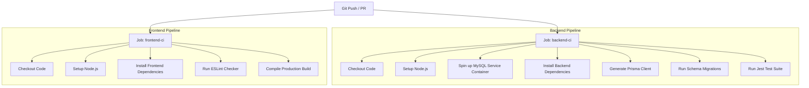

# CI/CD Workflow Explanation

This project includes a fully defined continuous integration (CI) pipeline configured via GitHub Actions.

## CI Configuration File Path
The workflow configuration is defined in [.github/workflows/ci.yml](file:///.github/workflows/ci.yml).

## Pipeline Trigger Events
The CI checks trigger automatically on:
- All **pushes** to the `main` or `master` branches.
- All **pull requests** opened against `main` or `master` branches.

---

## Workflow Jobs Details

The workflow is broken down into two parallel jobs to optimize execution times: `backend-ci` and `frontend-ci`.

### 1. Backend CI Job (`backend-ci`)
* **Operating System**: `ubuntu-latest`
* **MySQL Service**: A MySQL service container is provisioned side-by-side using GitHub service containers, configured with credentials matching the test configuration.
* **Steps**:
  1. **Checkout Repository**: Pulls down the code.
  2. **Setup Node.js Environment**: Installs Node.js version 20.x.
  3. **Install Dependencies**: Runs `npm ci` in `/backend` to install precise lockfile dependencies.
  4. **Generate ORM Client**: Executes `npx prisma generate` to construct the typed TypeScript Prisma client.
  5. **Apply Database Migrations**: Runs `npx prisma migrate deploy` to deploy schema tables to the container MySQL instance.
  6. **Run Integration Tests**: Executes `npm run test` (which triggers `jest --runInBand` with `NODE_ENV=test`) to verify all route and controller permissions.

### 2. Frontend CI Job (`frontend-ci`)
* **Operating System**: `ubuntu-latest`
* **Steps**:
  1. **Checkout Repository**: Pulls down the code.
  2. **Setup Node.js Environment**: Installs Node.js version 20.x.
  3. **Install Dependencies**: Runs `npm ci` in `/frontend` to install frontend packages.
  4. **Run Linter Checks**: Runs `npm run lint` to enforce formatting and prevent common React/Next.js syntax mistakes.
  5. **Run Build Validation**: Runs `npm run build` to verify the frontend successfully compiles into static and server-rendered bundles without TypeScript or layout compiler errors.
