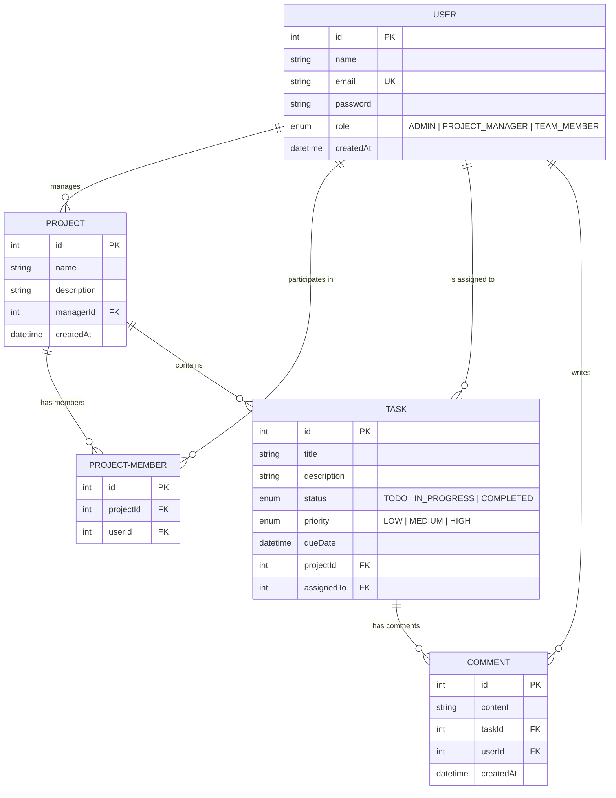

# Entity Relationship Diagram (ERD)

Below is the Entity Relationship Diagram for the Project and Team Task Management Platform, showcasing the database models, their attributes, and relationships.

## Relationships Details

1. **User - Project (Manager)**: A User (typically with `PROJECT_MANAGER` or `ADMIN` role) can manage multiple projects (`1 to many`). A Project must have exactly one manager (`many to 1`).
2. **User - ProjectMember**: A User can be assigned to multiple projects as a member (`1 to many`). A Project can have multiple project members (`1 to many`). This resolves a many-to-many relationship between Users and Projects.
3. **Project - Task**: A Project contains multiple tasks (`1 to many`). A Task belongs to exactly one Project (`many to 1`).
4. **User - Task**: A User can be assigned to multiple tasks (`1 to many`). A Task can be assigned to at most one user (`many to 0..1`).
5. **Task - Comment**: A Task can have multiple comments (`1 to many`). A Comment is posted on exactly one Task (`many to 1`).
6. **User - Comment**: A User can post multiple comments (`1 to many`). A Comment is authored by exactly one User (`many to 1`).
